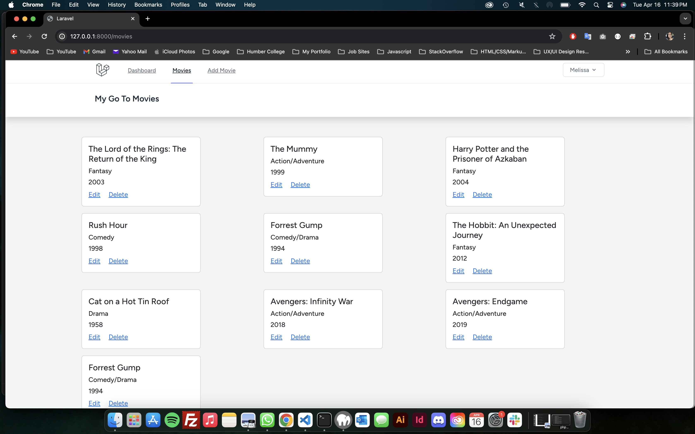
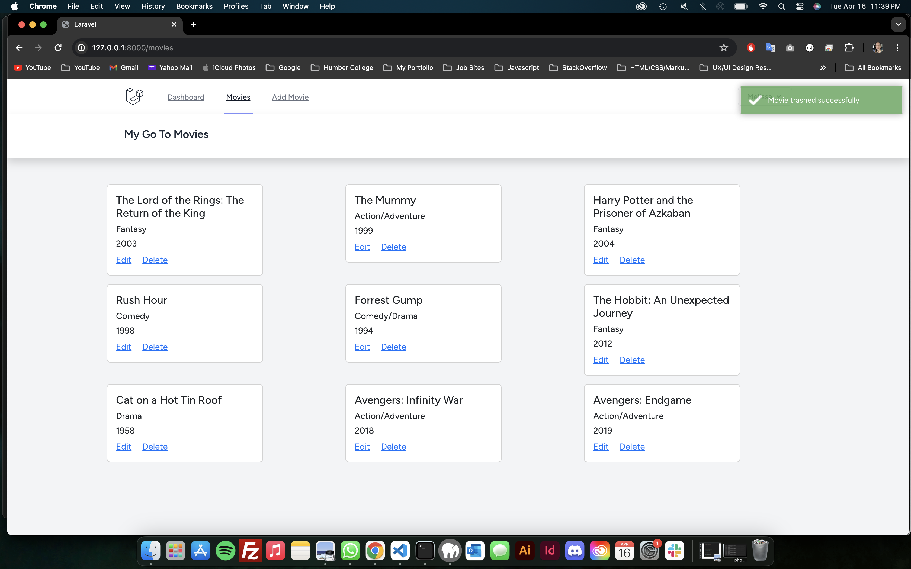
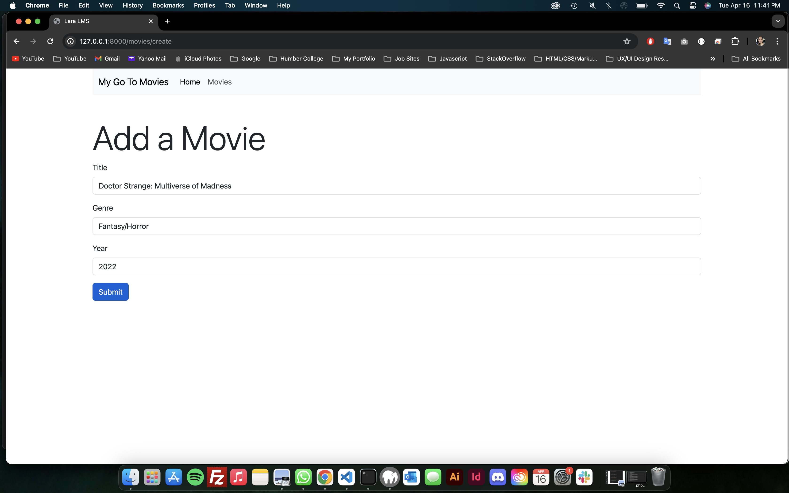
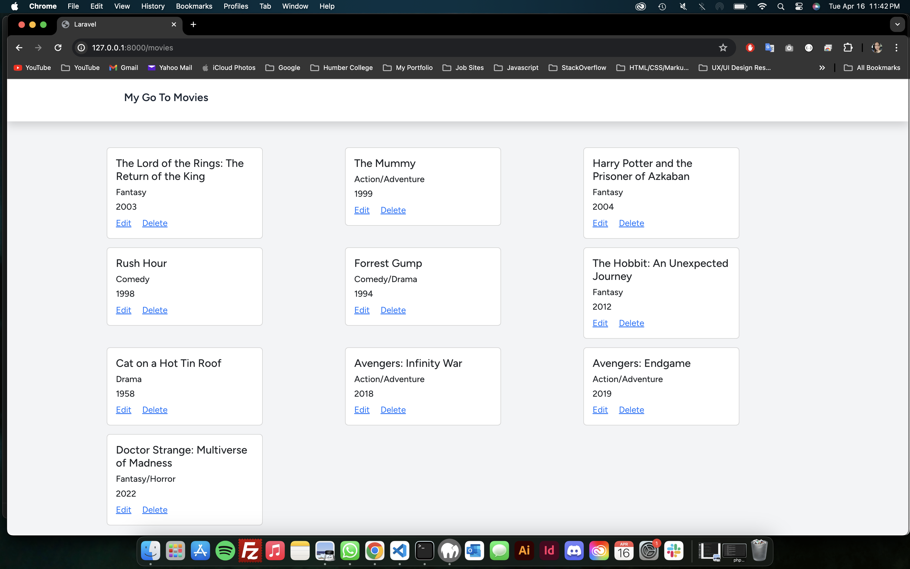
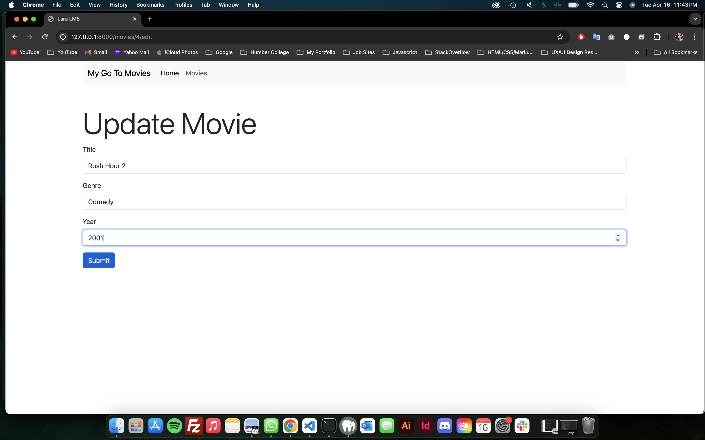
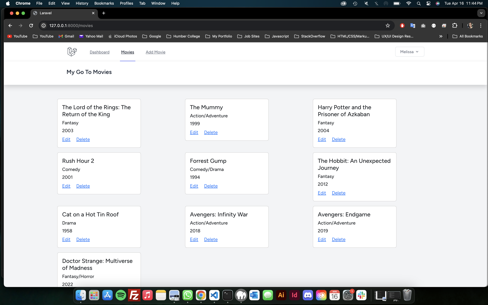

## Introduction

Welcome to my movie collection app, where I showcase my go-to movies for different moods and occasions. Built with Laravel, this application allows me to manage and share my favorite films effortlessly. Whether it's a classic drama, an action-packed adventure, or a heartwarming comedy, this platform lets me organize and curate my movie preferences seamlessly.

## Features and Database Schema

This application encompasses several features tailored to simplify the management of my movie collection. The database schema, defined in the migration file, ensures efficient data storage and retrieval. The 'movies' table includes columns for the movie title, genre, release year, along with timestamps for creation and updates. Additionally, soft deletes are implemented, allowing for seamless trash management.

The MovieController facilitates essential CRUD operations. The 'index' method retrieves and displays all movies, while 'create' and 'edit' methods provide intuitive interfaces for adding and modifying movie details. Each movie entry is presented with its title, genre, and release year, offering easy navigation and management. The application also incorporates form validation to ensure data integrity during movie creation and updates. Error handling mechanisms provide informative feedback, guiding me through the input process and preventing submission of invalid data.

The 'DatabaseSeeder' class populates the database with initial data, including sample movies, ensuring a seamless user experience from the start. Each movie entry is initialized with its title, genre, and release year, enriching the collection and providing a diverse range of options.

## Userflow Screenshots

Index
 

Delete
 

Add
 

 

Update
 

 
